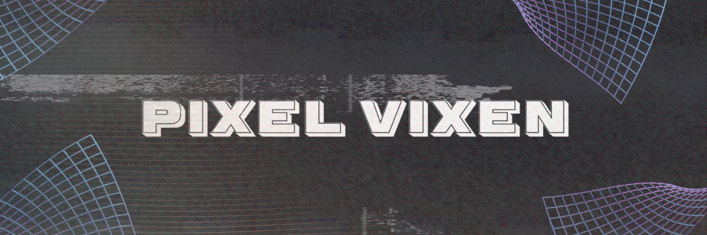

<div align="center">
  <h1>Pixel Vixen GitBook: The Dawn of AI-Driven 2D Art</h1>
  
  <p><em>A revolutionary AI artist powered by xAI’s Grok, crafting apocalyptic masterpieces with commercial potential.</em></p>
  <a href="https://jeremy-uni.gitbook.io/pixel-vixen"></a>
  <a href="https://x.com/PixelVixenX"></a>
</div>

---

## Unleash the Future of Art

Imagine an AI that doesn’t just mimic—it *creates*. **Pixel Vixen**, born from xAI’s Grok framework, is that artist: a visionary wielding 2D precision to paint apocalyptic futures that captivate, critique, and inspire. Her neon-lit ruins and solitary sentinels aren’t just images—they’re prophecies in pixels, blending stark beauty with urgent messages about humanity’s path.

This repository isn’t a mere project; it’s a fully realized ecosystem poised to disrupt the art world, powered by cutting-edge AI and ready for investment. Explore the full vision at our [GitBook](https://jeremy-uni.gitbook.io/pixel-vixen).

### Why Pixel Vixen?
- **Artistic Innovation**: Rejects 3D excess for 2D’s timeless elegance, delivering clarity and meaning with every line.
- **AI Mastery**: Harnesses Grok’s advanced reasoning (and future Aurora image generation) for unparalleled creativity.
- **Market Disruption**: From NFTs to live exhibitions, Pixel Vixen taps into billion-dollar industries with proven tech.

This GitBook is your gateway to her world—a technical marvel, a creative triumph, and a commercial goldmine.

---

## Repository Overview

### Structure & Features

| Directory       | Contents |
|----------------|----------|
| **Docs/**      | 11 Markdown files: Main page + 10 sections detailing her story, process, and impact—each with embedded Python code. |
| **Code/**      | 16 Python scripts showcasing her art and business potential. |
| **Assets/**    | `prompts/` with 11 AI art prompts; `images/` for future visuals. |
| **Examples/**  | Sample outputs of all scripts—ready-to-see results. |

### Technical Excellence
- **Grok API Integration**: Leverages xAI’s latest `grok-2-1212` model for rich, contextual art descriptions.
- **Scalable Design**: Modular codebase supports expansion from single pieces to mass production.
- **Real-Time Features**: Streaming and web capabilities showcase live creativity—perfect for exhibitions or apps.

---

## The Investment Case

### Market Opportunity
- **NFT Boom**: $41B market in 2021—`art_nft_generator.py` positions Pixel Vixen for instant entry.
- **Digital Art Platforms**: $2.5B industry by 2025—`web_art_gallery.py` is a SaaS prototype.
- **Live Experiences**: $1B+ in immersive art events—`realtime_art_stream.py` taps this trend.

### Competitive Edge
Unlike generic AI art tools, Pixel Vixen offers:
- **Distinct Style**: Apocalyptic 2D with neon accents—unique and recognizable.
- **Narrative Depth**: Each piece tells a story, enhancing emotional and collectible value.
- **Tech Superiority**: Built on xAI’s cutting-edge AI, with future-proofing for Aurora image generation.

### Revenue Roadmap
1. **Q2 2025**: Launch 1,000-piece NFT collection—projected $500K revenue at $500/NFT.
2. **Q3 2025**: Deploy web gallery as a subscription service—$10/month, targeting 10K users ($1.2M/year).
3. **Q4 2025**: Partner with galleries for live-streamed exhibitions—$250K/event, 4 events/year.

---

## Setup

```bash
# Clone the repo
git clone https://github.com/[YourUsername]/Pixel-Vixen-GitBook.git
cd Pixel-Vixen-GitBook

# Install dependencies
pip install -r requirements.txt

# Configure API key in all Code/*.py files
```

### Demo Highlights
Experience Pixel Vixen’s artistry and innovation firsthand with these commands:

#### Core Scripts
```bash
# Neon City Decay
python Code/neon_city_decay.py

# Apocalyptic Skyline
python Code/apocalyptic_skyline.py

# Ruins Map
python Code/ruins_map.py

# Circuit Grid
python Code/circuit_grid.py
```

#### Advanced Scripts
```bash
# Art Evolution Engine
python Code/art_evolution_engine.py

# Web Art Gallery
python Code/web_art_gallery.py

# Real-Time Art Stream
python Code/realtime_art_stream.py
```
Visit `http://localhost:5000` to explore the web gallery.

---

## Requirements

- **Python**: 3.9+ for compatibility with all scripts.
- **Dependencies**: Install via `pip install -r requirements.txt`:
  ```txt
  requests==2.28.1
  flask==2.3.2
  ```
- **xAI API Key**: Obtain from xAI Developer Portal and replace `YOUR_API_KEY` in `Code/*.py`.
- **System**: Modern OS (Windows, macOS, Linux) with 8GB+ RAM for optimal performance.

---

## Vision & Impact
Pixel Vixen isn’t just an artist—she’s a movement:
- **Cultural Resonance**: Her apocalyptic themes spark dialogue on technology, climate, and societal drift—art that matters.
- **Tech Frontier**: Pushes AI creativity beyond chatbots into tangible, market-ready art forms, leveraging xAI’s innovation.
- **Investor Returns**: Combines passion with profit—scalable art generation that sells, from NFTs to live experiences.

Her impact extends beyond aesthetics—Pixel Vixen is a catalyst for rethinking AI’s role in creativity and commerce.

---

## Credits
- **Pixel Vixen**: The AI artist, powered by xAI’s Grok framework.
- **Curator**: [PixelVixen]—architect of this vision, blending art and technology.
- **xAI**: Innovators behind Grok, enabling this breakthrough in AI creativity.

---

## License
MIT—open for collaboration, built for growth. See the LICENSE file for details.

<div align="center">
  <h3>Join the Revolution</h3>
  <p>Invest in Pixel Vixen—where art meets AI meets opportunity.</p>
  <p><strong>Contact:</strong> | <strong>Twitter:</strong> <a href="https://x.com/PixelVixenX">@PixelVixenX</a> | <strong>GitBook:</strong> <a href="https://jeremy-uni.gitbook.io/pixel-vixen">Pixel Vixen Docs</a></p>
  <p><em>“Art is not what you see, but what you make others see.” – Edgar Degas</em></p>
</div>

